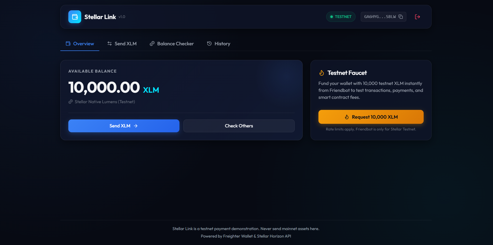
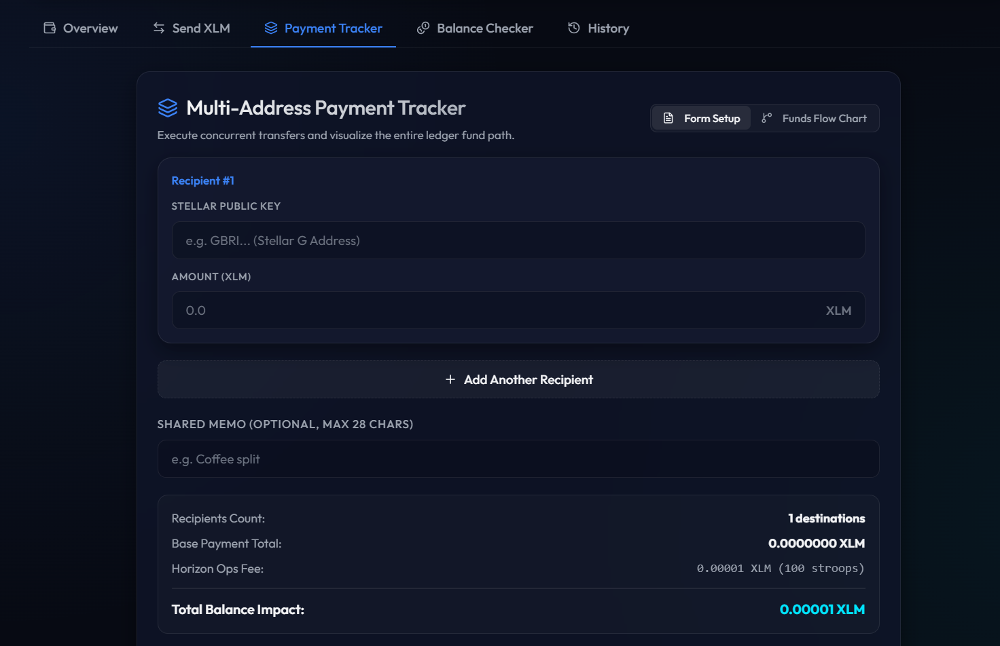
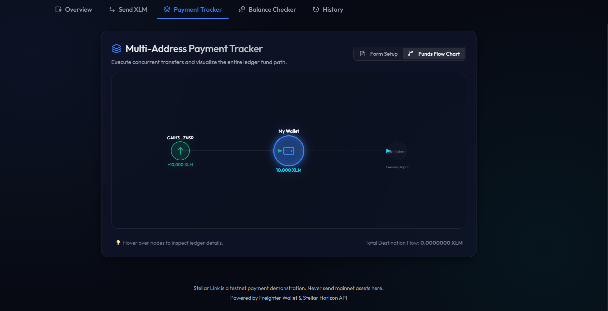
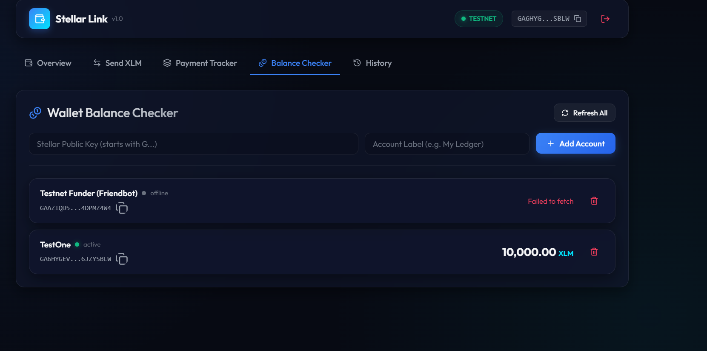

# Stellar Link | Testnet Wallet dApp & Soroban Smart Contract

Stellar Link is a premium, dark-mode decentralized wallet client and smart contract system for the Stellar Testnet. Connecting directly with the browser-injected **Freighter wallet extension**, it enables users to track native balances, request testnet faucet funds, execute atomic multi-address payments, and visualize the entire ledger path of their assets.

<p align="center">
  
</p>

---

## 🌟 Key Features

- **Wallet Connection**: Securely authenticate and interact using the **Freighter Wallet Extension** configured for Stellar Testnet.
- **Dashboard Overview**: Access real-time balances, view account activation state, and fund new accounts instantly with 10,000 testnet XLM from the **Friendbot Faucet**.
- **Payment Tracker (Multi-Address Transfers)**: Bundle payments to multiple public keys concurrently into a single Stellar atomic transaction. Save transaction fees and execute batch transfers with a single Freighter signature.
- **Visual Fund Path Tracker**: A custom, interactive SVG flowchart that traces transaction histories:
  - **Incoming Sources**: Displays where the wallet's funds originated (e.g. Faucet or other active public keys) by querying Horizon payment logs.
  - **Your Wallet**: Features a central node presenting your wallet's address and active balance.
  - **Recipient Flow**: Connects recipients with glowing, animated lines that speed up during transaction execution.
  - **Ledger Tooltips**: Hover over nodes to inspect full public keys, XLM amounts, and ledger transaction hashes.
- **Balance Checker**: Monitor multiple custom watchlists concurrently, persisted in browser `localStorage`.
- **Transaction History**: View a timeline of the 15 most recent payment-related operations with directional indicators and explorer logs.

---

## 📸 Component Showcase (Resized Screenshots)

### 1. Multi-Address Transfer Setup
Set up batch payments to multiple destinations with live address format regex validation and total cost estimations:
<p align="center">
  
</p>

### 2. Interactive SVG Funds Path Tracker
Track the entire path of assets from origin sources into your wallet, and out to multiple destination nodes with CSS path flow animations:
<p align="center">
  
</p>

### 3. Multi-Account Balance Checker Watchlist
Track balances across several accounts simultaneously with live status indicators:
<p align="center">
  
</p>

---

## 🛠️ Soroban Smart Contract

Stellar Link incorporates a custom **Soroban smart contract** located under the [`contracts/payment_tracker`](./contracts/payment_tracker) directory. This contract records payment events directly on-chain for verifiability and decentralized history indexing.

### Contract Features
- **Payment Logging**: Stores payment items detailing sender, recipient, amount, memo, and block timestamp.
- **Persistent History Pruning**: Automatically prunes historical entries, retaining the 20 most recent records to prevent state bloat.
- **On-Chain Events**: Publishes structured `payment` events to support off-chain indexer synchronization (e.g. Mercury, Horizon event streams).
- **Authentication**: Enforces sender signatures using `sender.require_auth()`.

### Deployed Contract Details (Testnet)
- **Contract ID**: `CDUX6WNHB7TFLC2PJV5O3WTYWYZT4Q7TRACKCCAB45GTYPX6X37JLW4RYX2B`
- **Horizon Explorer Link**: [View Contract on Stellar Expert](https://stellar.expert/explorer/testnet/contract/CDUX6WNHB7TFLC2PJV5O3WTYWYZT4Q7TRACKCCAB45GTYPX6X37JLW4RYX2B)

### Building & Testing the Contract

To run tests and compile the contract:
1. Ensure Rust and Cargo are configured with the WASM target:
   ```bash
   rustup target add wasm32-unknown-unknown
   ```
2. Navigate to the contract folder and execute tests:
   ```bash
   cd contracts/payment_tracker
   cargo test
   ```
3. Compile the production WASM smart contract binary:
   ```bash
   cargo build --target wasm32-unknown-unknown --release
   ```

---

## 🚀 Quick Start (Frontend dApp)

### 1. Prerequisites
- **Node.js**: Version 16 or higher.
- **Freighter Browser Extension**: Set network to **Testnet** (*Settings (gear icon)* > *Networks* > *Testnet*).

### 2. Install & Run Frontend
Clone the repository, navigate to the folder, and run:
```bash
# Install dependencies
npm install

# Start local Vite development server
npm run dev
```
Open **[http://localhost:5173](http://localhost:5173)** in your browser.

### 3. Production Build
To build the static assets for production:
```bash
npm run build
```
Vite outputs the built assets inside the `dist/` directory.

---

## 📂 Project Structure

```
├── Cargo.toml                      # Root workspace configuration
├── contracts/
│   └── payment_tracker/            # Soroban Smart Contract
│       ├── Cargo.toml              # Contract package configuration
│       └── src/
│           ├── lib.rs              # Contract entry point and logic
│           └── test.rs             # Contract unit tests
├── public/                         # Public assets (icons, screenshots)
├── src/                            # Frontend source code
│   ├── components/                 # React UI Components
│   │   ├── BalanceChecker.tsx      # Watches balance watchlists
│   │   ├── Dashboard.tsx           # Balance overview and faucet request
│   │   ├── Header.tsx              # Connect controls and network badges
│   │   ├── PaymentForm.tsx         # Single transfer form
│   │   ├── PaymentTracker.tsx      # Batch payments & interactive SVG chart
│   │   └── TransactionHistory.tsx  # Timeline of recent operations
│   ├── services/
│   │   └── stellar.ts              # Horizon API client & Freighter integrations
│   ├── App.tsx                     # Main layout & tab routing
│   ├── index.css                   # Global responsive dark-mode styling
│   └── main.tsx                    # React mounting entry point
└── vite.config.ts                  # Vite config injecting Node polyfills
```
